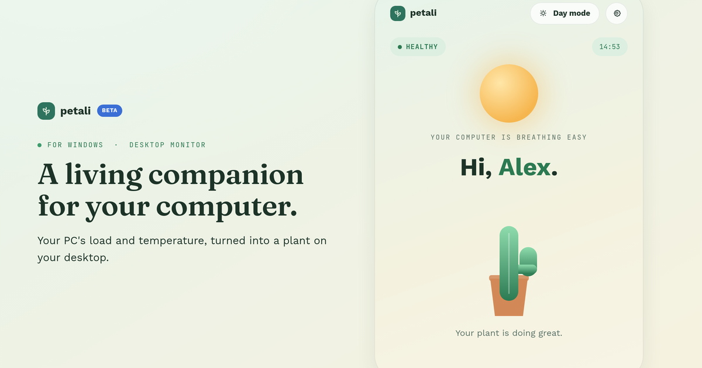

  

<h1 align="center">
   Petali
</h1>

<b>A living companion for your computer.</b>

  <a href="https://petali.netlify.app/"><b>🌐 Website</b></a> ·
  <a href="https://petali.netlify.app/#demo"><b>▶ Live demo</b></a> ·
  <a href="https://petali.netlify.app/#download"><b>⬇ Download</b></a> ·
  <a href="https://petali.netlify.app/feedback.html"><b>💬 Feedback</b></a>

  

---

### For Windows · Desktop monitor

## Finally, a computer that speaks a language you understand.

Petali turns your PC's temperature, load, and uptime into a living plant on your desktop. When your machine rests, it blooms. When it's under strain, it wilts — and tells you exactly why.

**[→ Download Petali for free](https://petali.netlify.app/#download)** &nbsp;&nbsp;**[→ Try the live demo](https://petali.netlify.app/#demo)**

> 🌱 **Petali is currently in public beta.** Some features are still being refined and occasional bugs may occur. Your feedback helps shape the final release — thank you for using Petali!
> [Found a bug or have an idea? Send feedback →](https://petali.netlify.app/feedback.html)

 

## How it works

Three states, one glance at your screen. The plant's state follows your CPU's temperature and load in real time.

| State | | |
|---|---|---|
| **Healthy** | *Blooming and active* | Your PC is running at a good temperature with low load. Leaves move, colors stay rich. |
| **Tired** | *Losing its shine* | Higher load or temperature. Leaves droop slightly, animations slow down. |
| **Wilting** | *Needs your help* | Critical values. The plant dries out and Petali gives you a concrete tip on what to do. |

 

## Pick a plant, give it a name

On first launch you choose a language and one of five plant types. Each comes with a default name — or set your own.

| Plant | Default name | Style |
|---|---|---|
| Cactus | **Pixel** | Sturdy flora |
| Sedge | **CyberFern** | Dense cyber undergrowth |
| Bonsai | **Sprout** | Small and cute |
| Ivy | **ByteGreen** | Spreads across the interface |
| Carnivorous plant | **DigiBloom** | Bold, modern look |

 

## Everything that shapes your plant

Everything Petali tracks in the background — no task manager required.

- **Processor** — CPU load (%), CPU temperature (°C)
- **Memory & storage** — RAM (size & load), SSD (space used)
- **Cooling** — GPU temperature (°C), fan speed (RPM)
- **Time & habits** — active time today, daily activity log

Petali also supports **Day mode** and **Night mode**, so the app fits the look of your desktop at any hour.

 

## Long-term insights

Not just right now — the full picture over time. Petali quietly keeps a history running in the background, so trends are just as easy to read as your plant's current mood.

- **Today** — daily summary of how your machine's load and temperature moved through the day
- **This week** — weekly trends, spotting the days your PC works hardest
- **Over time** — long-term history of thermals and usage patterns across weeks and months

 

## Fully customizable

Two zones, one drag. Your layout saves automatically, and you can always reset it back to default.

| Zone | | Widgets |
|---|---|---|
| **Zone A** | visible right away | Time · CPU load · CPU temperature |
| **Zone B** | expandable panel | RAM · SSD · GPU temperature · Fan speed |

 

## Download

Setup takes less than a minute. Petali runs quietly in the background and speaks up only when it matters — and that's just the start, there's a lot more waiting inside!

**[⬇ Download Petali_Setup.exe](https://petali.netlify.app/#download)**

Windows 10/11 · ~75 MB installer · no account required

 

## About this repository

This repository contains the **source of the Petali marketing website** (`index.html`, `feedback.html`, and static assets) hosted at [petali.netlify.app](https://petali.netlify.app/) — it does **not** contain the source code of the Petali desktop application itself.

The site is built with plain HTML, CSS and JavaScript, uses the Fraunces, Work Sans, and JetBrains Mono typefaces from Google Fonts, and is deployed on Netlify.

 

## Project status

🌱 **Public beta.** Some features are still being refined and occasional bugs may occur — [feedback](https://petali.netlify.app/feedback.html) is very welcome.

 

## License

Petali is licensed under the GNU General Public License v3.0.
See the [LICENSE](LICENSE) file for details.

 

## Links

- 🌐 Website — [petali.netlify.app](https://petali.netlify.app/)
- ▶ Live demo — [petali.netlify.app/#demo](https://petali.netlify.app/#demo)
- ⬇ Download — [petali.netlify.app/#download](https://petali.netlify.app/#download)
- 💬 Feedback — [petali.netlify.app/feedback.html](https://petali.netlify.app/feedback.html)
- 👤 Author — [milanfridrich.is-a.dev](https://milanfridrich.is-a.dev)

---

  Petali — a living companion for your computer 
  © 2026 <a href="https://milanfridrich.is-a.dev">Milan Fridrich</a>

